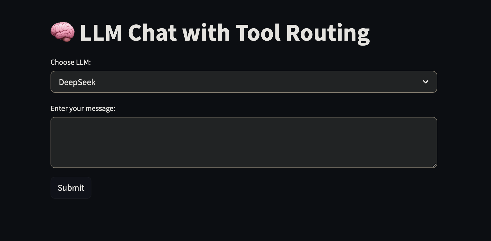
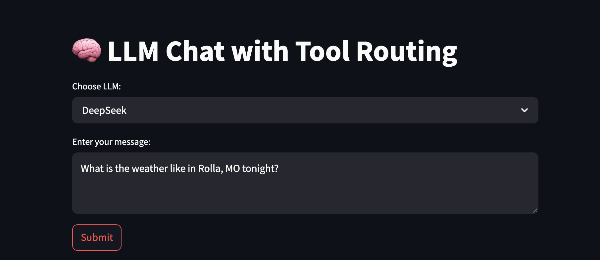
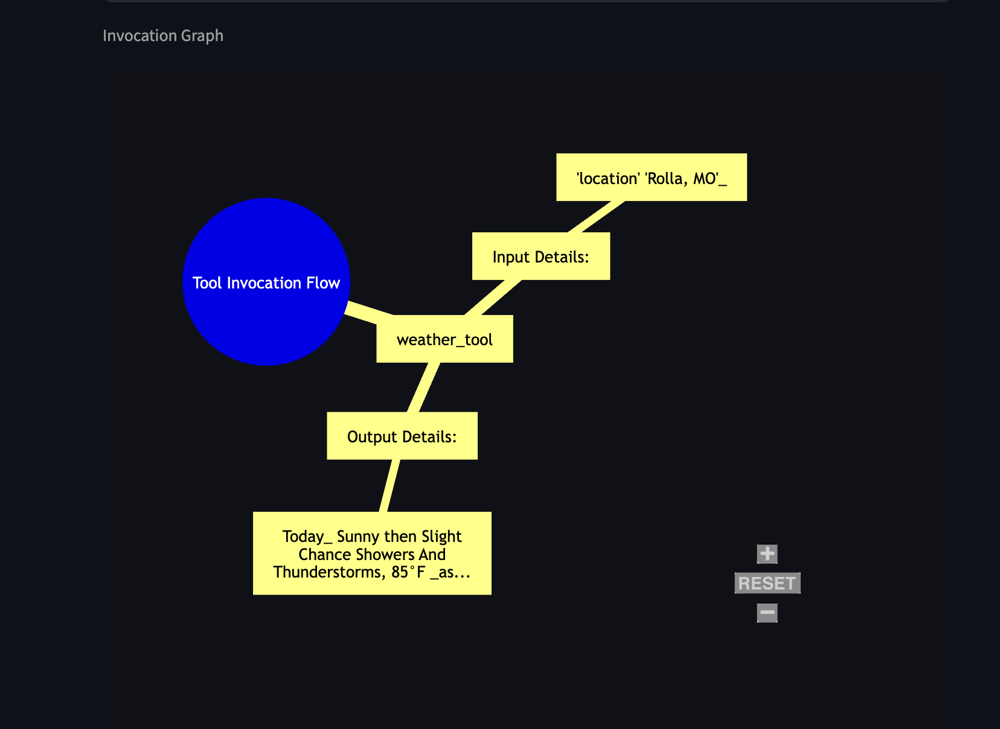
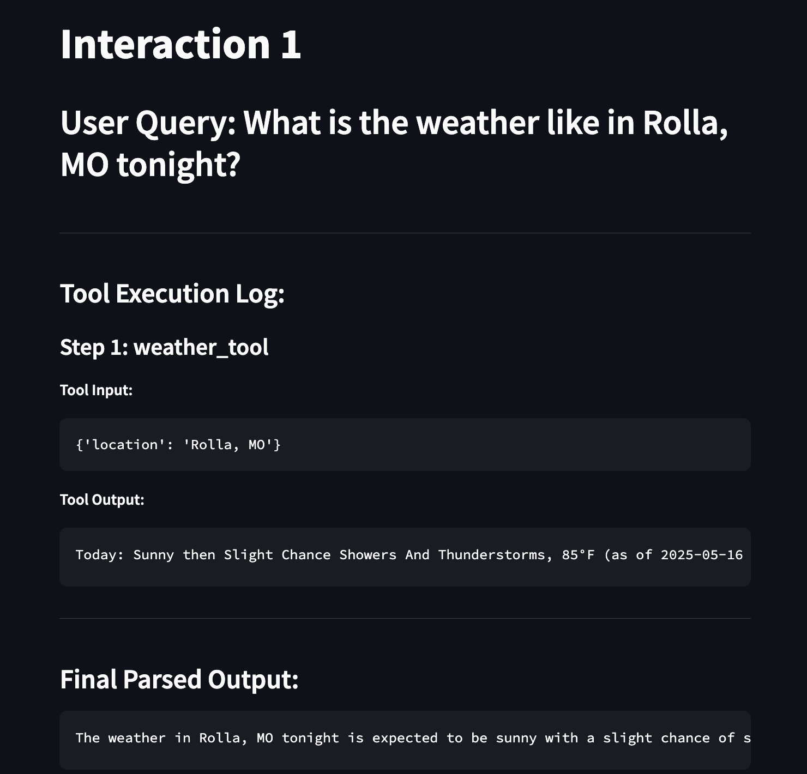

# Tool-Augmented Chatbot: System Overview

 
## Chapter 1: User Interaction - The Chat Interface
 

A user interacts with the Chatbot through a web-based interface. The user types their query into a text input field and submits it.
 
This interface is built using **Streamlit** (as seen in `visuals.py`).
 
### What is Streamlit?
 

Streamlit is a Python library that simplifies the creation of web applications. For developers, it's a way to build interactive user interfaces using Python code, without needing extensive web development knowledge (HTML, CSS, JavaScript). Streamlit handles the complexities of rendering web elements, allowing developers to focus on the application's logic and functionality.
 

In this project, `visuals.py` uses Streamlit to:
*   Display the application title (e.g., "LLM Chat with Tool Routing") via `display_title()`.
*   Provide a text area for user input via `get_user_input()`.
*   Include a "Submit" button to send the query.
*   Offer a selection widget for choosing the underlying Large Language Model (LLM), such as DeepSeek or Claude.
 
 
 
## Chapter 2: Core Logic - LangGraph Orchestration
 
When a user submits a query, it's processed by the Chatbot's core logic, which is managed by **LangGraph** (defined in `lang_graph.py`). This system uses a Large Language Model (LLM) as its central reasoning component.
 
### What is LangGraph?
 
LangGraph is a library for building stateful, multi-actor applications with LLMs. It allows developers to define complex workflows as graphs, where the LLM can decide to call upon external "tools" to gather information or perform actions.
 
Essentially, LangGraph enables the LLM to:
1.  Analyze the user's query and determine if it can answer directly.
2.  If not, identify if a specialized "tool" (a helper function) is needed to fulfill the request.
 
 `lang_graph.py` sets up this decision-making process:
 *   It defines an `AgentState` to maintain the history and current state of the conversation.
 *   The `call_model` function is the entry point where the LLM first processes the user's message.
*   The LLM is made aware of available tools (via `core_llm.bind_tools(available_tools)`). For instance, if a user asks, "What's the weather in Paris?", the LLM can recognize the need for the `weather_tool`.
 *   LangGraph uses a `ToolNode` to execute the chosen tool.
*   The `tools_condition` acts as a conditional router: if a tool is selected by the LLM, the workflow executes that tool; otherwise, the LLM might proceed to generate a direct answer.
*   The system includes a mechanism to prevent redundant tool calls. If a tool (e.g., `weather_tool`) has just been executed with specific arguments, and the LLM proposes to call the exact same tool with the exact same arguments again, this redundant call is suppressed to enhance efficiency.
 
The compiled workflow (`workflow.compile()`) results in an intelligent agent capable of dynamic decision-making and tool utilization.
 
## Chapter 3: Specialized Capabilities - The Tools
 
The LLM, orchestrated by LangGraph, can leverage a suite of specialized tools to perform specific tasks or retrieve external information. These tools are individual Python functions designed for particular purposes:
 
 *   **Professor Defini (`define_tool.py`):**
    *   **Functionality:** Provides definitions for terms or concepts.
    *   **Mechanism:** When asked to define something (e.g., "Define 'artificial intelligence'"), this tool uses an LLM to generate a concise definition.
 
 *   **Weather Wiz (`weather.py`):**
    *   **Functionality:** Retrieves current weather information for a specified location.
    *   **Mechanism:** For a query like "What's the weather like in Rolla, MO tonight?", this tool first uses the Nominatim service to geocode the location (find its latitude and longitude). It then queries the National Weather Service (NWS) API to fetch the weather forecast. It includes error handling for network issues or unresolvable locations.
 
 *   **News Hound (`web_search.py`):**
    *   **Functionality:** Performs web searches to find current information or news.
    *   **Mechanism:** For queries like "What's the latest news about self-driving cars?", this tool uses the Tavily search API to find relevant web pages and returns a summary of the search results.
 
 *   **Speedy Summarizer (`summarizer.py`):**
    *   **Functionality:** Condenses long pieces of text into shorter summaries.
    *   **Mechanism:** If provided with a lengthy text, this tool will summarize it to a specified maximum word count (e.g., 150 words), extracting the key information.
 
These tools act as specialized assistants, providing the LLM with capabilities beyond its inherent knowledge. The system is extensible, allowing for the addition of new tools as needed.
 
## Chapter 4: Processing a Query - From Input to Output
 
Here's a simplified flow of how a user query like "What's the weather like in London?" is processed:
 
 1.  **User Input:** The user types the query into the Streamlit interface (`visuals.py`).
 2.  **LangGraph Receives:** The `agent_graph` in `lang_graph.py` takes the message.
3.  **LLM Decision:** The LLM, as part of the `call_model` function, analyzes the query and determines that the `weather_tool` is required.
4.  **Tool Execution:** LangGraph routes the request to the `ToolNode`, which executes the `weather_tool`.
5.  **`weather_tool` Action (`weather.py`):**
     *   Finds London's geographical coordinates.
     *   Fetches weather data from the NWS API.
     *   Returns the weather information (e.g., "London: Mostly cloudy, 15°C (as of 2023-10-27 14:00:00 UTC)").
6.  **Response Generation:** The weather information is passed back to the LLM via LangGraph.
7.  **LLM Formulates Reply:** The LLM uses this information to craft a user-friendly response, such as "The weather in London is currently mostly cloudy at 15°C."
8.  **Display to User:** Streamlit displays the final answer in the chat interface.
 
## Chapter 5: Transparency and Debugging - Visualizations and Logs
 
The system offers features for understanding its internal operations:

 
*   **Tool Invocation Graph (`mermaid_graph.py`):**
    For queries involving tool usage, `visuals.py` can render a visual graph (using Mermaid syntax via `st_mermaid`) illustrating the sequence of tool calls and data flow. This graph helps visualize which tools were used and in what order. Text is sanitized to ensure proper rendering.

 
*   **Detailed Interaction Log (`visuals.py` - `display_full_log`):**
    The interface can display a comprehensive log of each interaction. This log includes the user's query, details of each tool called (name, input, output), and the final parsed response from the LLM. This provides a step-by-step record of the chatbot's process.

 
## Chapter 6: Quality Assurance - Automated Testing (`prompt_test.py`)
 
To ensure reliability and correct functionality, the Chatbot undergoes automated testing using `prompt_test.py`. This script uses Pytest and Selenium for end-to-end testing.
 
The test script performs the following key actions:
 1.  **Starts the Application:** It programmatically starts the Streamlit application server (`streamlit_server` fixture). It includes a utility (`kill_process_on_port`) to ensure that the required port is free before starting the server.
    *   It checks for any visible error messages on the page using `get_error_text_if_present`. If errors are detected, the test fails.
    *   It verifies expected outcomes, such as ensuring that tools are invoked when appropriate (e.g., by checking that the "No tool invocation steps to graph." message *does not* appear if a tool was expected to run).
5.  **Debug Support:** The script can optionally keep the browser window open after a test (`time.sleep(60)`) to allow for manual inspection in case of unexpected behavior. It also streams the Streamlit server's output (`stream_output`) for debugging purposes.
 
## Summary
 
The Tool-Augmented Chatbot combines a user-friendly Streamlit interface with the powerful reasoning capabilities of an LLM orchestrated by LangGraph. By leveraging a suite of specialized tools, the Chatbot can answer a wide range of queries, retrieve external information, and perform specific tasks. Visualizations and detailed logs provide transparency into its operations, while automated testing ensures its reliability.
 
This system is designed to be an informative and helpful assistant, capable of complex interactions and adaptable to new functionalities through the addition of more tools.
 
 ---
 
**Key Project Files:**
*   `tests/prompt_test.py`: Automated end-to-end testing script.
*   `tests/test_queries.py`: Predefined queries for automated testing.
*   `tools/define_tool.py`: Tool for defining terms.
*   `tools/summarizer.py`: Tool for summarizing text.
*   `tools/weather.py`: Tool for fetching weather information.
*   `tools/web_search.py`: Tool for performing web searches.
*   `lang_graph.py`: Core LLM and tool orchestration logic using LangGraph.
*   `mermaid_graph.py`: Utility for generating Mermaid graph definitions (used by `visuals.py`).
*   `visuals.py`: Streamlit-based user interface, including display of logs and graphs.
 

